---
# Your first program in Kotlin
---

---
# Create and use variables in Kotlin

---
# Create and use functions in Kotlin
---

---

# Practice Problems Kotlin Basics

---
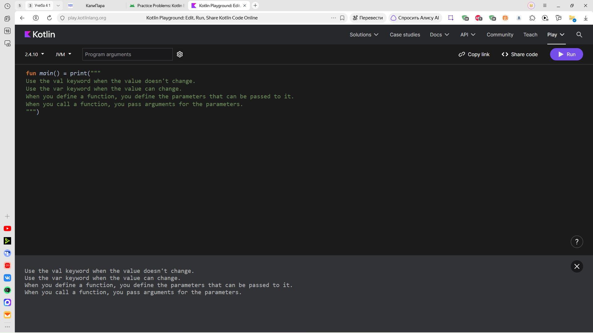

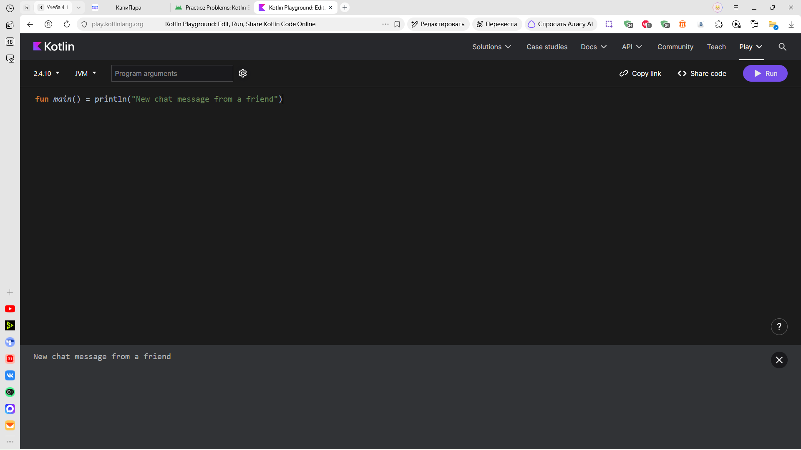

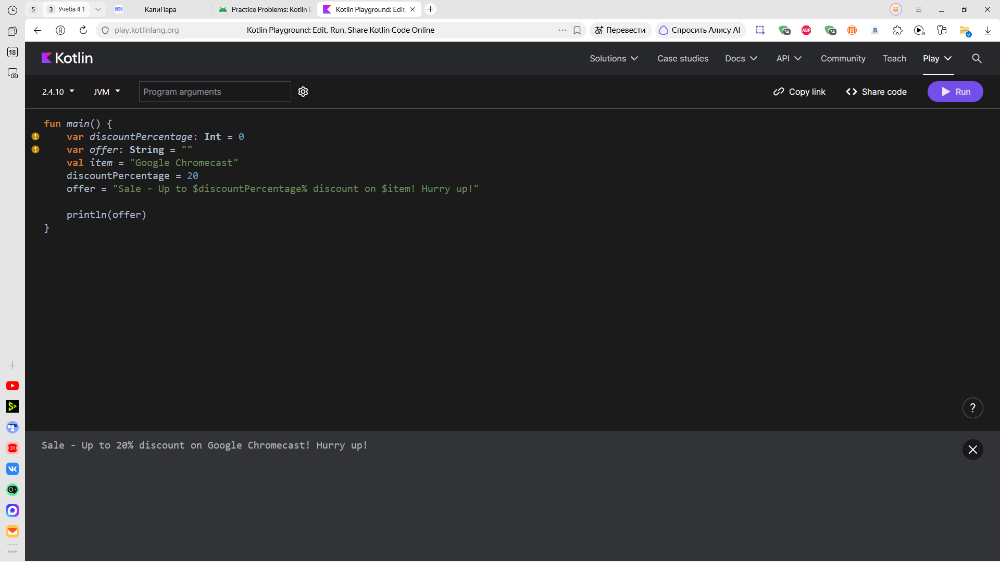

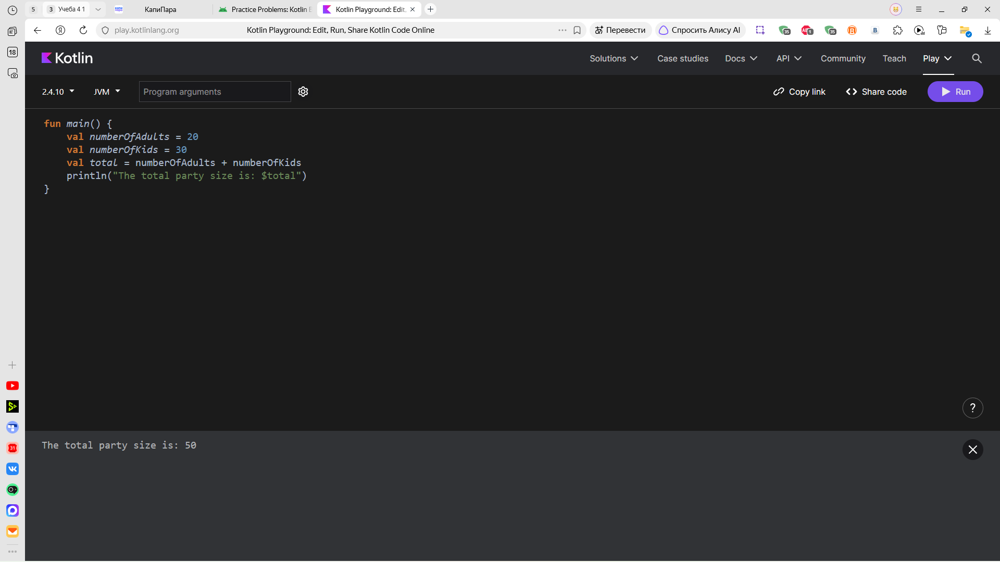

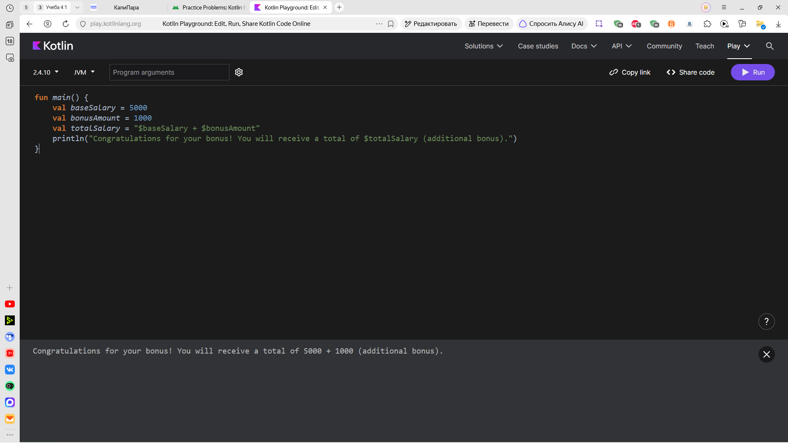

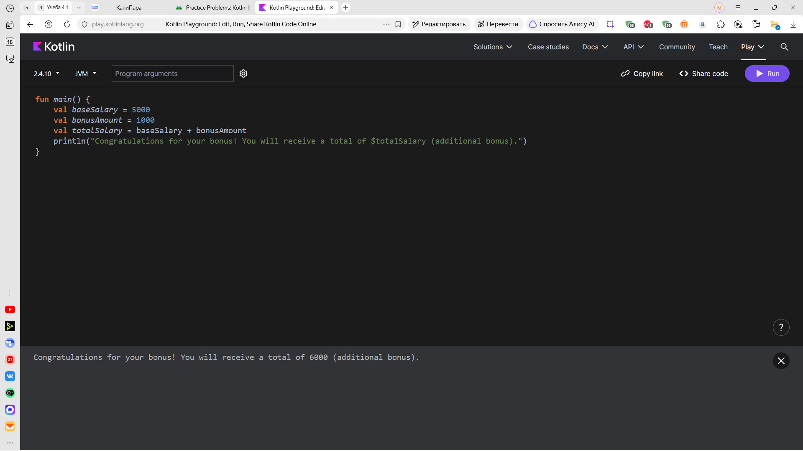

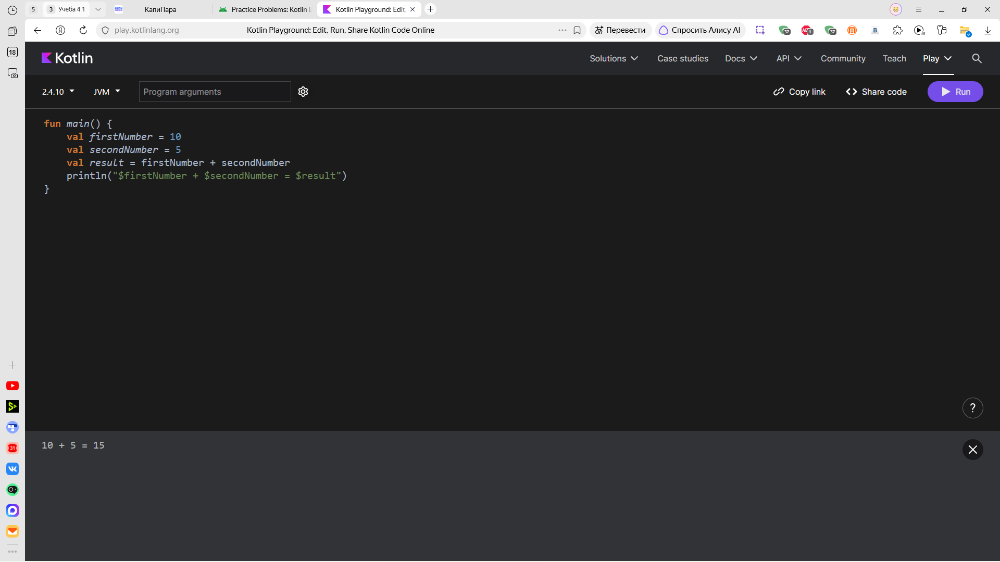

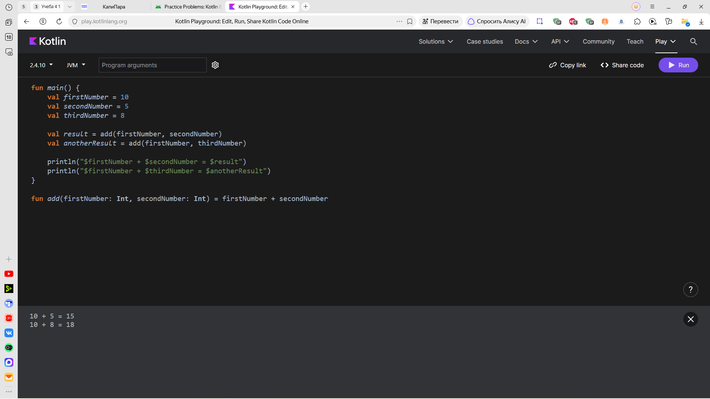

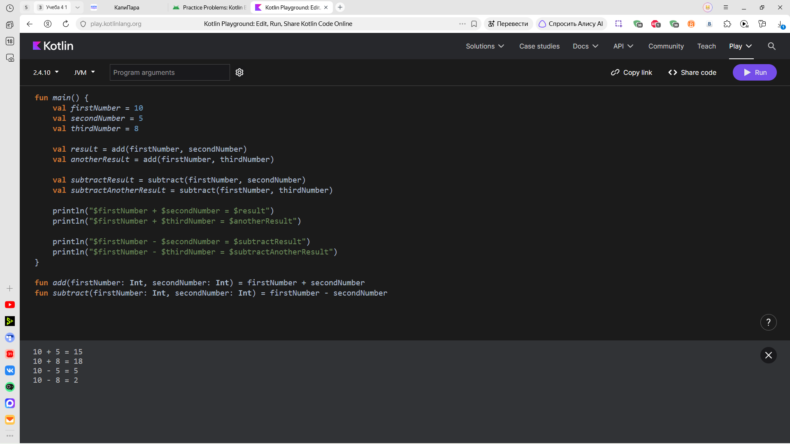

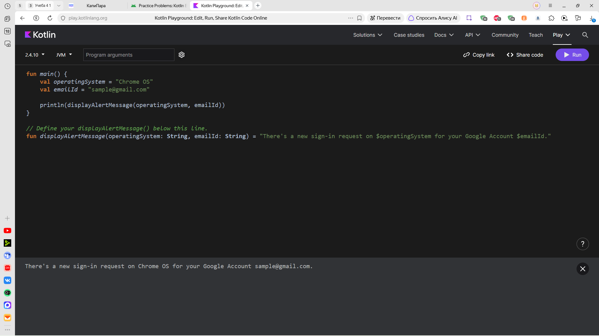

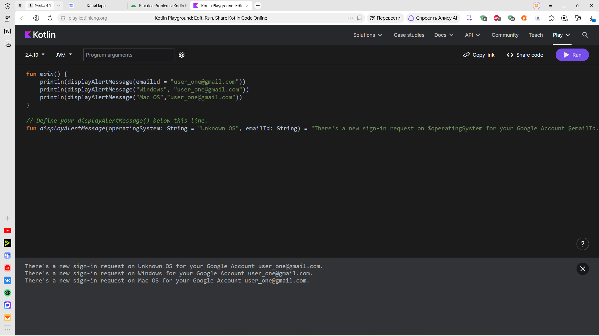

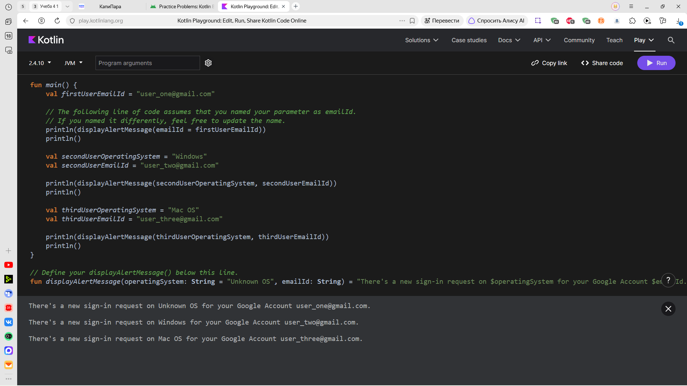

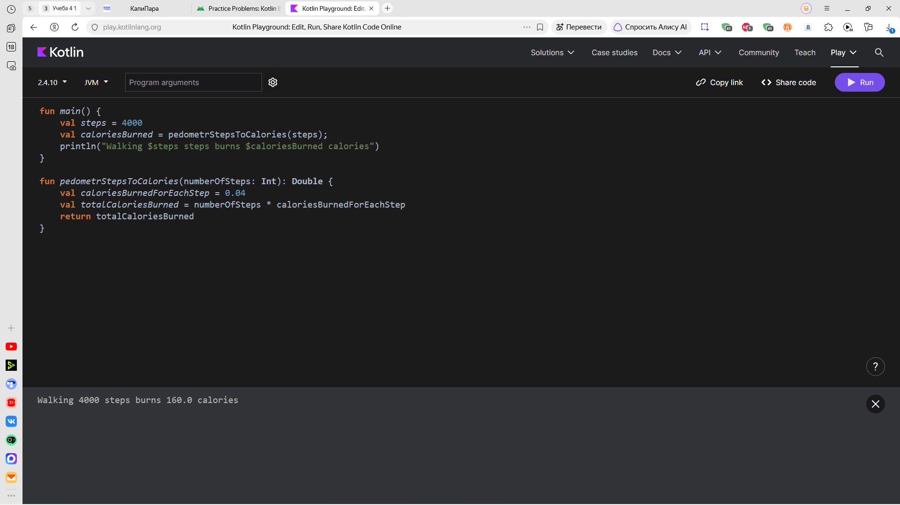

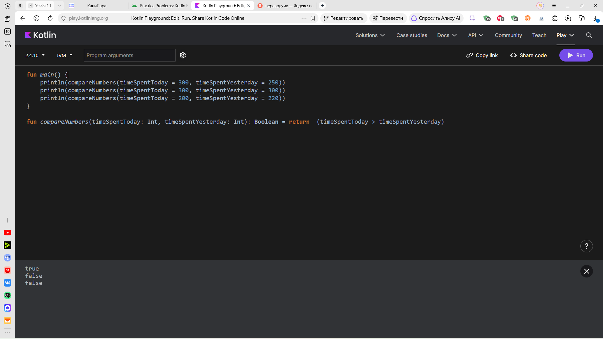

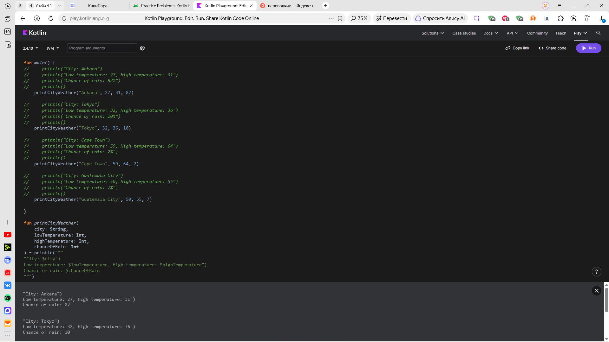

---
# Setup Android Studio
---

---
# Simple text app
---

---
# Add Image
---

---
# Practice
---
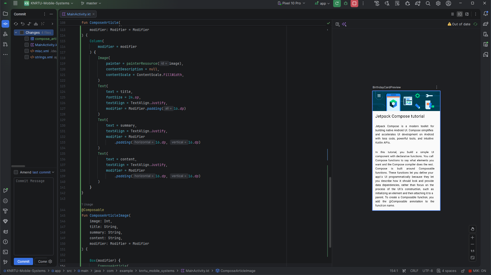
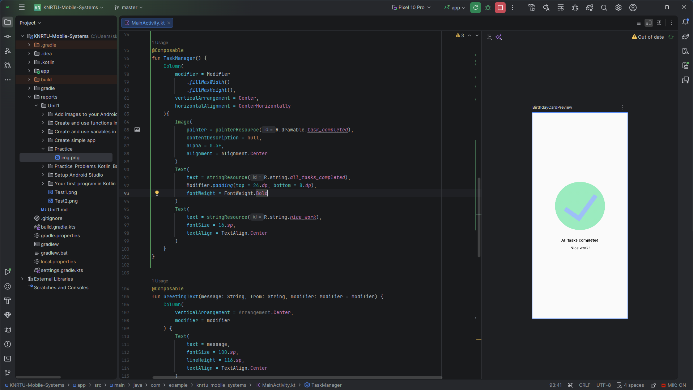
